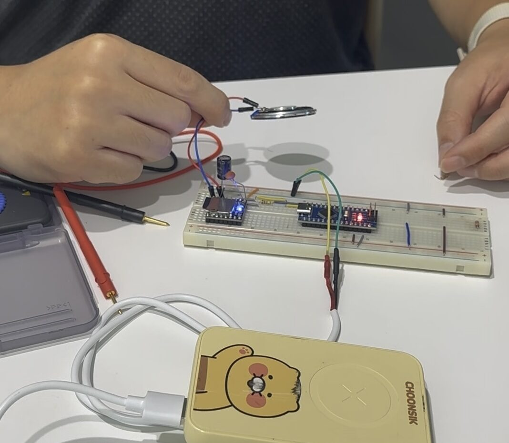
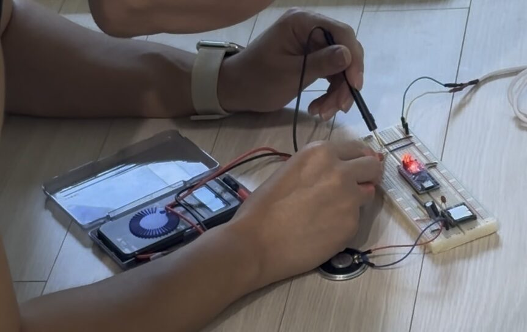
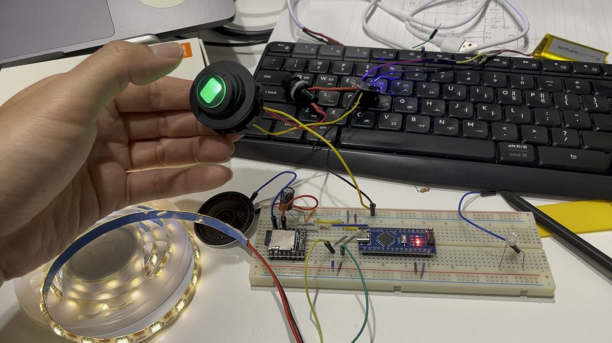

# 02. Prototyping the Circuit on a Breadboard

> 🎬 **Want to see the finished bike first?** This post focuses on the build process. [Watch a short clip of the finished bike on Instagram](https://www.instagram.com/reel/Dcsc5PiyJVf/).

The goal was simple.

**Turn the switch on, play the engine-start sound, and turn the light on.**

Before soldering anything or mounting parts on the bike, I wanted to make sure the basic idea actually worked the way I imagined.

So I started by wiring everything up temporarily on a breadboard.

At this stage, it did not need to look clean or compact.

The only goal was to **prove that the idea worked.**

<p align="center">
  
</p>

<p align="center">
  <em>Arduino Nano and DFPlayer Mini wired up temporarily on a breadboard</em>
</p>

## Starting with the engine sound

The first thing I wanted to test was the sound.

I kept the initial setup as simple as possible:

* Arduino Nano
* DFPlayer Mini
* microSD card
* Speaker

The DFPlayer Mini is a small audio module that can play MP3 files from a microSD card.

An Arduino can send commands to the module and tell it which file to play, which made it a good fit for the engine-start sound I had in mind.

I copied a motorcycle startup sound to the microSD card and named the file in the format expected by the DFPlayer.

On the Arduino side, I used the `DFRobotDFPlayerMini` library.

The basic flow looked like this:

```text
Arduino powers on
      ↓
Initialize DFPlayer
      ↓
Set volume
      ↓
Play engine-start MP3
```

For the first test, I deliberately left the switch out of the equation. I simply made the Arduino play one sound as soon as it powered on.

**Testing one thing at a time felt like the easiest way to isolate problems when something went wrong.**


## The first obstacle was not the circuit

Ironically, the first thing that stopped me was not the wiring at all. It was the Arduino development setup.

After installing the library, I tried to upload the sketch, but the Arduino Nano did not show up properly on my computer.

I was using an official USB-C cable, so I assumed data communication would work without any issue. But no serial port appeared in the Arduino IDE.

After trying a different USB cable together with an adapter, the board was recognized immediately.

I had expected the first problem to be somewhere in the electronics. I did not expect a cable to block me before I even got started.

Once the Arduino was finally detected and I could upload code, the actual circuit testing could begin.

## The first engine-start sound

I connected the Arduino, DFPlayer, and speaker, then powered everything on.

A moment later,

**the engine-start sound came out of the speaker.**

That was the first confirmation that the core idea was actually going to work.

But the test also revealed another issue.

After power-cycling the circuit a few times and pressing the Arduino's Reset button, I noticed that **the speaker volume sounded different** depending on how the program had started.

## Same code, different volume?

The code was already setting the DFPlayer volume to its maximum value of `30`.

Yet after a cold power-up, it sometimes sounded as if that setting had not been applied properly.

While investigating, I realized that the DFPlayer is not immediately ready the instant it receives power. It needs a short amount of time to initialize.

So I changed the code to wait briefly before applying the volume setting.

After experimenting with a few values, a delay of about **300 ms** worked reliably with my setup.

```cpp
delay(300);
player.volume(30);
```

It is only a tiny change in the code, but it made a noticeable difference in real-world behavior.

This was also my first reminder that with small hardware modules, correct wiring is only part of the story. Sometimes you also have to account for **how long the hardware takes to become ready after power-up.**

## Then the voltage suddenly dropped

While continuing the tests, another problem appeared.

At one point, the DFPlayer and speaker stopped behaving properly. When I checked the voltage with a multimeter, the reading was far lower than expected.

My first suspects were the power source and the DFPlayer itself.

I tried powering the circuit from a 5 V phone charger instead of the power bank, and I even swapped in the spare DFPlayer I had ordered.

Neither fixed the problem.

Eventually, after checking the circuit step by step, the culprit turned out to be something much simpler: **a poor contact on the breadboard.**

After reseating the wires and cleaning up the connections, the voltage returned to normal and the DFPlayer started working again.

<p align="center">
  
</p>

<p align="center">
  <em>Whenever something behaved strangely, I started checking the voltage first</em>
</p>

A small side note: back in college, I once spent a miserable week before a competition demo trying to figure out why a Raspberry Pi kept crashing for no obvious reason. The problem eventually turned out to be an unstable cheap power adapter.

Apparently I needed that lesson twice.

From this point on, whenever the circuit behaved strangely, I stopped assuming the code was the problem and started by asking:

**“Is the voltage actually what it is supposed to be?”**

## Adding the switch and LED

Once the sound playback was stable, I started adding the input and output I had originally planned.

The Arduino would read the state of the switch, and turning the switch on would trigger the engine-start sound while also powering the LED.

The intended behavior was still very simple:

```text
Switch OFF
   ↓
Nothing happens

Switch ON
   ↓
Arduino runs
   ↓
Play engine-start sound once
   +
LED ON
```

By this point, I had confirmed that the original idea was feasible, at least from the electronics side.

<p align="center">
  
</p>

<p align="center">
  <em>Final version of the circuit on the breadboard</em>
</p>


## From breadboard prototype to a real bike circuit

On a breadboard, long jumper wires and scattered components are not a problem.

Waterproofing does not matter either.

But once the circuit has to live on a real bike, everything changes.

The Arduino, DFPlayer, power circuit, and battery all need to fit inside a small ABS enclosure. The wiring has to stay connected even while the bike is shaking and moving around.

I also wanted a way to adjust the LED brightness, and I needed a reliable way to supply 5 V from the battery.

And of course, a breadboard itself was never going to be mounted on the bike.

In the next step, I will take the circuit that worked on the breadboard, choose the actual components for the final build, and solder everything onto a perfboard.

→ [03. Building the Final Circuit](03-circuit-build.md)
