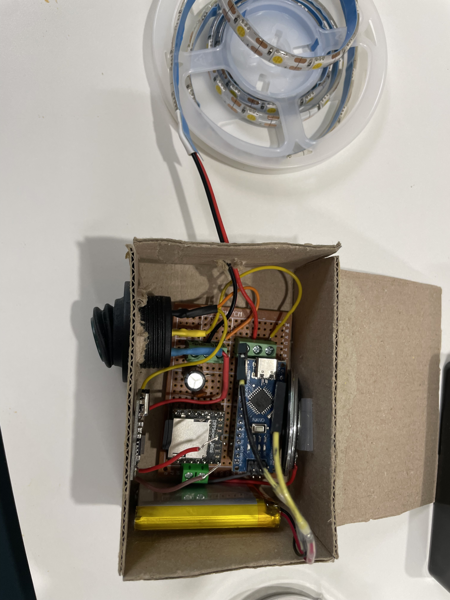
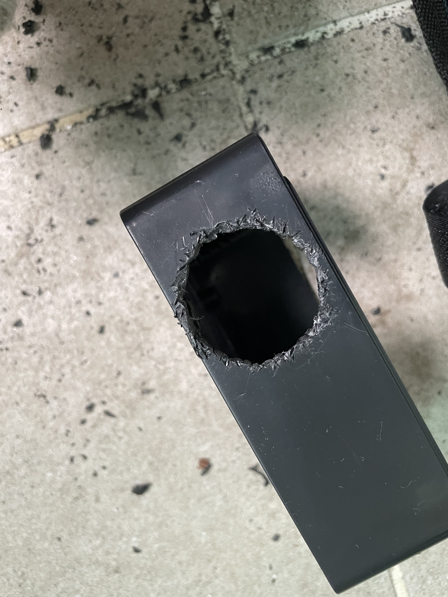
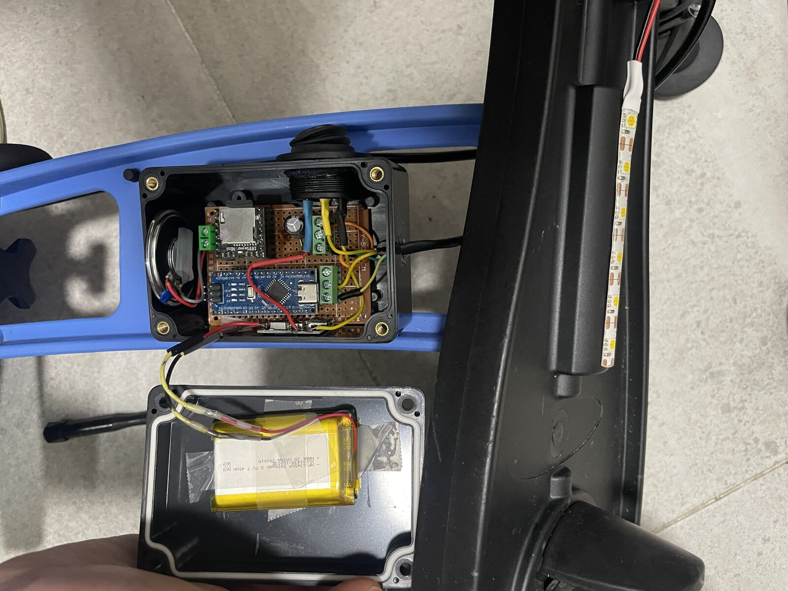

# 04. Enclosure and Bike Installation

> 🎬 **Want to see the finished bike first?** [Watch a short clip on Instagram](https://www.instagram.com/reel/Dcsc5PiyJVf/).

With the circuit finished, it was finally time to put everything on the bike.

The first question was simple: **would all of it actually fit inside the enclosure?**

Before cutting into the real ABS box, I made a rough mock-up at about the same size and tried different arrangements for the circuit board, battery, and speaker.

  

  <em>Testing the layout with a rough mock-up before touching the real enclosure</em>

## Cutting the enclosure was harder than expected

For the final build, I used a water-resistant ABS enclosure.

The tricky part was making openings for the switch and the LED cable. Getting clean holes with the tools I had at home turned out to be much harder than I expected.

The result was definitely rough around the edges. I even ended up melting the opening for the LED cable with a soldering iron and cleaning it up afterward.

At that point, the priority was not perfect machining. It was making sure the parts fit and keeping water out.

So once everything was in place, I sealed the gaps around the switch and cable openings with **neutral-cure silicone**.

  

  <em>The switch opening after some quality time with a household drill and a pair of cutters</em>

## Mounting it on the bike

I packed the circuit and battery into the enclosure, connected the external wiring to the switch and LED, and mounted everything on the FirstBIKE.

The switch went where my son could reach it easily, and the LED was mounted at the front.

Then I turned it on.

**The engine-start sound played, and the LED lit up.**

The circuit that had started out on a breadboard was finally part of the bike.

  

  <em>The electronics finally mounted on the FirstBIKE</em>

At this point, the build was functionally almost complete.

In the final post, I'll wrap up the finished build, what I learned from actually using it, and what I would improve next time.

→ [05. Final Build and Improvements](05-final.md)
