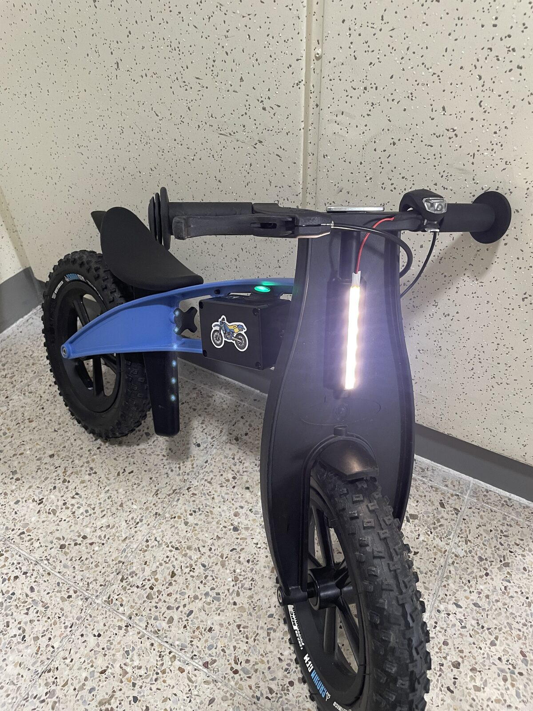
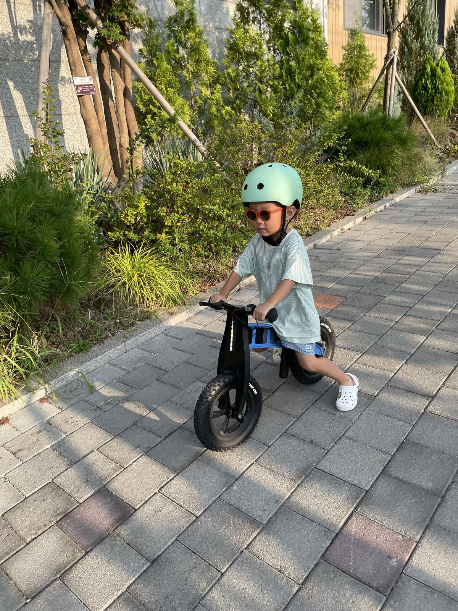

# 05. Final Build and Improvements

> 🎬 **See the finished build in action:** [Watch the short Instagram Reel](https://www.instagram.com/reel/Dcsc5PiyJVf/).

What started as a breadboard prototype had now been soldered onto perfboard, packed into an enclosure, wired up, sealed, and mounted on the FirstBIKE.

The original idea was finally working exactly as planned:

**Switch ON → engine-start sound → LED ON**

It is a very simple sequence, but seeing it work on the actual bike was surprisingly satisfying.

The black enclosure hanging off the bike did look a little more DIY than I had imagined, but given the space constraints, it was about as clean as I could make it.

  

  <em>The finished First Bike Moto Mod</em>

## More than just a small circuit

At the beginning, I thought this would be a quick project: add a switch, play an engine sound, turn on a light.

Once I tried to make it usable on a real bike, though, the list kept growing:

- Battery and power delivery
- Arduino and DFPlayer control
- Speaker and LED
- Soldering and perfboard layout
- Enclosure packaging
- External wiring
- Water resistance
- Mounting everything securely to the bike

In the end, I spent more time figuring out how to turn a working circuit into something that could survive real-world use than I did on the circuit itself.

## The biggest limitation: volume

The main thing I noticed after using it outside was the speaker volume.

Indoors, the small speaker connected directly to the DFPlayer sounded fine. Outdoors, traffic and general street noise made the engine-start sound feel much quieter.

The DFPlayer was already running at its maximum volume setting, so there was no more headroom in software.

A future version could use a slightly larger speaker or a small amplifier, although enclosure space is already tight. Finding the right balance between **volume and size** would probably be the next challenge.

## The part I enjoyed most

The most rewarding part of this project was not learning a particular circuit or component.

It was taking one of my son's small interests and turning it into something he could actually use.

The whole project started because he would stop to look at motorcycles, notice whether their lights and engines were on, and use those details in his play.

That simple idea eventually became a real circuit, enclosure, wiring, and a modified bike.

Along the way, every unexpected problem turned into another small lesson.

  

  <em>Putting the finished build to use</em>

## What I would change next time

The current version already does what I originally wanted, but there are still a few things I would like to improve:

- A smaller, cleaner enclosure
- A larger speaker or compact amplifier
- More sounds or controls if the idea grows further

After spending so much time searching for PCB layouts and circuit parts, my targeted ads started filling up with custom PCB services. That planted one more idea in my head.

For what this project actually does, the Arduino Nano is honestly overkill. A custom PCB with only the parts and functions I really need could make the whole build much smaller and cleaner.

Maybe that is a project for another time.

For now, this is where First Bike Moto Mod ends.

**The goal was simply to make my son's FirstBIKE feel a little more like a real motorcycle.**

It turned into a much more enjoyable DIY project than I expected.

---

[← 04. Enclosure & Installation](04-enclosure.html) · [Build log](index.html)

🌐 [한국어 버전](../ko/05-final.html)
