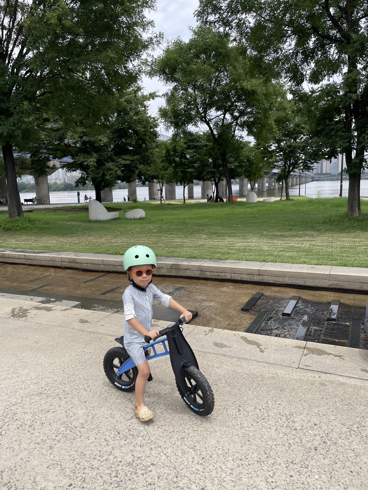
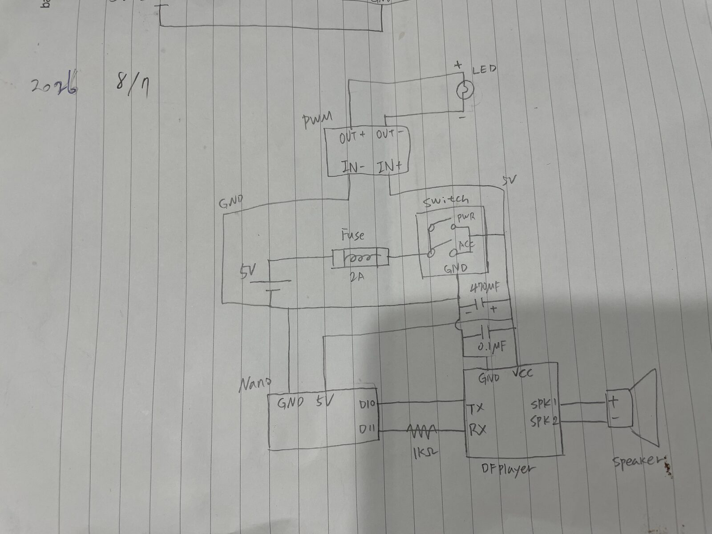

# 01. 프로젝트 시작 — 퍼스트바이크를 오토바이처럼

> 🎬 **완성 모습 먼저 보기:** 완성된 모습이 궁금하다면 [Instagram Reel에서 짧은 영상 보기](https://www.instagram.com/reel/Dcsc5PiyJVf/).

아이(만3세)가 오토바이를 정말 좋아한다.

길을 걷다가 오토바이가 보이면 그냥 지나치는 일이 거의 없다. 가까이 가서 한참을 관찰하고, 요즘은 오토바이 모델도 하나씩 구분하기 시작했다.

관심은 단순히 "오토바이가 멋있다"는 수준을 조금 넘어섰다.

특히 요즘 가장 관심이 많은 건 **시동과 헤드라이트**다.

오토바이마다 시동을 어떻게 거는지 궁금해하고, 길가에 세워진 오토바이를 보면서도 헤드라이트가 켜져 있는지, 시동이 걸려 있는지를 유심히 살펴본다.

심지어 배달 오토바이를 보고는 불과 시동 상태를 단서로 상황을 추측하기도 한다.

"불이랑 시동을 켜놓고 갔으니까 잠깐 배달하러 간 것 같아. 다시 내려올꺼니까 아저씨 가는거 보고 가자."

"다 껐으니까 주차하고 집에 들어간 것 같아."

어른에게는 직관적인 차이지만(별로 관심 없기도 하고), 아이에게는 오토바이의 상태를 알아내는 꽤 중요한 단서인 것 같다.

## 자전거도 오토바이가 되기 시작했다

그러다 보니 자전거를 탈 때도 자연스럽게 오토바이 역할놀이를 하기 시작했다.

퍼스트바이크를 타면서 자신을 "오토바이 아저씨"라고 생각하고, 실제 오토바이를 타는 것처럼 출발하고 정차하고 배달 놀이를 좋아한다.

그 모습을 보다 문득 이런 생각이 들었다.

**아이의 오토바이에도 실제 오토바이처럼 시동을 걸고 불을 켜는 동작이 있으면 더 재미있지 않을까?**

그게 이 프로젝트의 시작이었다.

  

  <em>개조 전 퍼스트바이크</em>

## 처음 생각한 기능

처음부터 복잡한 것을 만들 생각은 없었다.

하고 싶었던 건 크게 두 가지였다.

1. 스위치를 조작하면 **오토바이 시동음이 재생될 것**
2. 시동과 함께 **헤드라이트처럼 LED가 켜질 것**

그리고 다시 스위치를 끄면 불도 꺼지게 만들고 싶었다.

조작 자체도 아이가 이해하기 쉽게 만들어서,

**스위치 ON → 시동 걸림 → 불 켜짐**

이라는 실제 오토바이와 비슷한 흐름을 만들어보는 것이 목표였다.

## 어떻게 만들까?

처음에는 단순한 스위치와 사운드 모듈만 있으면 될 줄 알았다.

하지만 원하는 동작을 하나씩 생각하다 보니 제어를 담당할 작은 MCU가 필요했고, 결국 **Arduino Nano**를 사용하기로 했다.

시동음 재생에는 **DFPlayer Mini**, 빛에는 **5V LED 스트립**을 사용하기로 했다.

대략적인 구성은 이렇게 잡았다.

* Arduino Nano
* DFPlayer Mini
* 스피커
* LED 스트립
* ON/OFF 스위치
* 배터리와 전원 회로

기능만 보면 간단해 보였다.

하지만 실제 자전거에 붙이려면 전자회로가 동작하는 것만으로는 부족했다.

배터리는 얼마나 커야 하는지, 회로를 어디에 넣을지, 비가 조금 와도 괜찮게 만들 수 있을지, 스위치와 LED까지 긴 배선을 어떻게 빼낼지 같은 문제들도 함께 해결해야 했다.

부품 선정 시에는 방수가 되어야 하니, 고르는데 제약사항도 많았다.

  

  <em>chatGPT와 논의하여 만든 회로 구성 초안</em>

## 일단, 책상 위에서부터

기구를 어떻게 만들고 자전거에 어떻게 설치할지 아직 잘 모르겠지만,

먼저 브레드보드 위에 Arduino Nano와 DFPlayer를 연결해 **내가 생각한 동작이 실제로 가능한지 확인하는 것**부터 시작했다.

코드도 작성해야 하고, 스피커도 연결해야 하고, LED와 전원도 테스트해야 한다.

그리고 예상대로 첫 테스트부터 여러 가지 문제가 생겼다.

다음 편에서는 실제 부품들을 브레드보드에 연결해 시동음을 재생하고 LED를 동작시키기까지의 과정을 정리해보려고 한다.

---

[제작기 목록](index.html) · [02. 브레드보드 회로 테스트 →](02-prototype.html)

🌐 [English version](../en/01-start.html)
