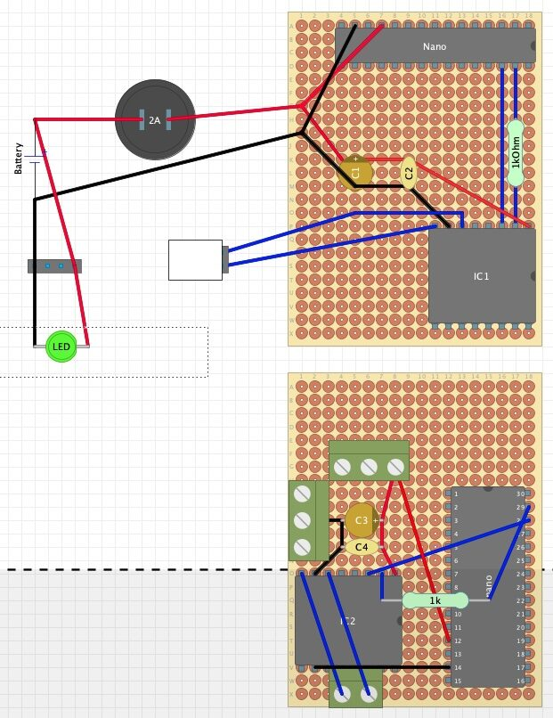
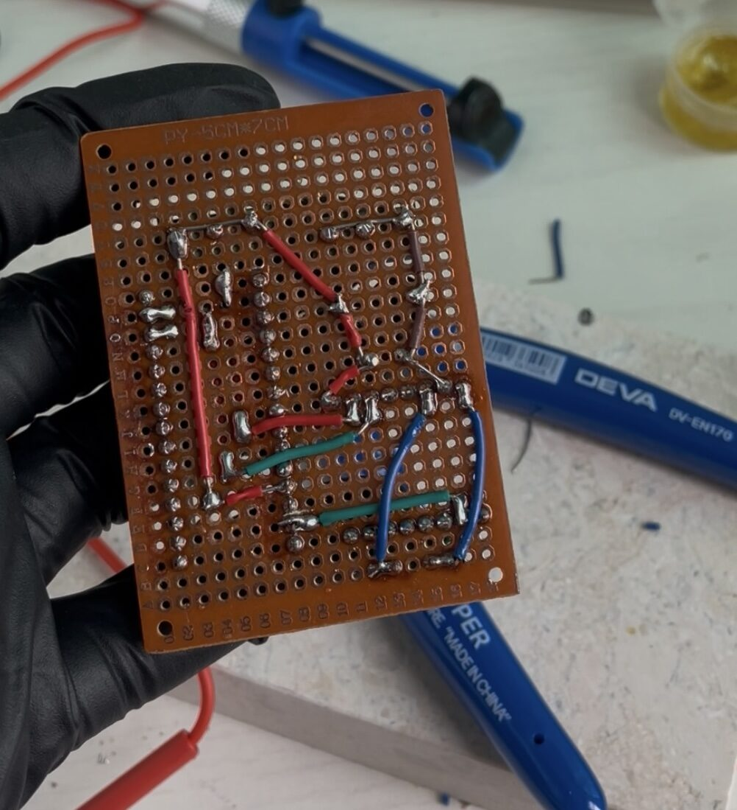
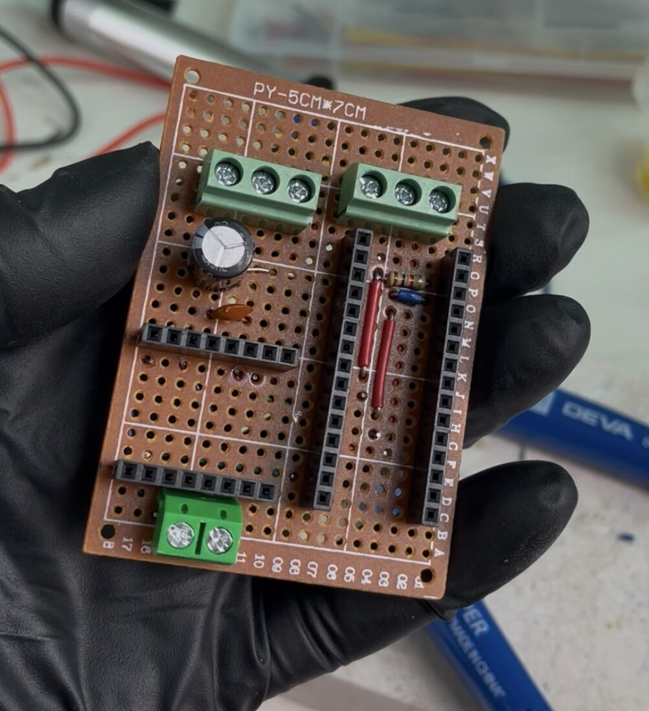

# 03. 실제 사용할 회로 만들기

> 🎬 **완성 모습 먼저 보기:** 완성된 모습이 궁금하다면 [Instagram Reel에서 짧은 영상 보기](https://www.instagram.com/reel/Dcsc5PiyJVf/).

브레드보드에서 원하는 동작은 확인했다.

이제 다음 목표는 PCB.

**책상 위에서만 동작하는 회로를 실제 자전거에 넣을 수 있는 형태로 만드는 것.**

브레드보드는 테스트하기에는 편하지만, 흔들리는 자전거에 그대로 달 수는 없다. 그래서 최종 회로는 만능기판에 납땜해서 만들어야 한다.

## 전원부터 다시 생각하기

처음에는 5V 보조배터리를 사용할 생각이었다.

하지만 실제 케이스 안에 넣으려고 하니 부피가 너무 컸고, 저전력 회로에서는 보조배터리가 자동으로 출력을 차단할 가능성도 있었다.

결국 작은 **3.7V 리튬 배터리 + 5V DC-DC 승압 모듈** 조합으로 방향을 바꿨다.

회로 보호를 위해 2A 퓨즈도 추가하고, LED 밝기를 조절할 수 있도록 PWM 디머도 넣었다.

최종적으로 케이스 안에는 대략 이런 부품들이 들어가게 됐다.

* Arduino Nano
* DFPlayer Mini
* DC-DC 승압 모듈
* 배터리
* 퓨즈
* PWM 디머
* 커패시터
* 만능기판

## 생각보다 어려웠던 건 '배치'

회로도만 보면 부품을 연결하는 방법은 이미 정해져 있었다.

문제는 **이걸 작은 ABS 케이스 안에 어떻게 넣느냐**였다.

DC-DC 모듈이나 퓨즈 홀더 같은 부품은 회로도에서 볼 때는 별로 커 보이지 않았는데, 실제로 한곳에 모아놓으니 상당한 공간을 차지했다.

그래서 더 작은 부품을 다시 찾아보기도 하고, 만능기판 위에서 Arduino와 DFPlayer의 위치를 여러 번 바꿔가며 배치를 고민했다.

이 과정에서 회로 설계와 실제 제품 제작은 꽤 다른 문제라는 걸 느꼈다.

DIYLC 라는 프로그램을 설치하고 부품들을 이리저리 배치해봤다.

  

  <em>납땜 전 만능기판 위 부품 위치를 정해보는 과정 (최종 버전은 아님)</em>

## 이제 납땜

배치를 어느 정도 정한 뒤 브레드보드의 연결을 하나씩 만능기판으로 옮겼다.

VCC와 GND는 여러 부품이 공유하기 때문에 기판 위에서 공통 전원 라인을 만들고, Arduino와 DFPlayer처럼 나중에 교체 가능성이 있는 부품은 헤더를 사용해 탈착할 수 있도록 했다.

납땜 자체도 너무 오랜만이라 시행착오가 많았다.

특히 일부 단자에는 납이 잘 붙지 않기도 했고, 한정된 공간에서 여러 전선을 연결하다 보니 생각보다 작업 시간이 오래 걸렸다.

그래도 하나씩 연결하고 멀티미터로 확인하면서 브레드보드 회로를 실제 기판으로 옮길 수 있었다.

  

  

  <em>만능기판에 회로를 옮기는 과정</em>

## 회로는 완성, 이제 진짜 어려운 부분

납땜까지 끝내고 다시 전원을 넣었을 때 브레드보드에서와 동일하게 시동음과 LED가 동작했다.

전자회로 쪽은 여기서 거의 완성됐다.

하지만 아직 중요한 문제가 남아 있었다.

**이 많은 부품과 배선을 어떻게 케이스에 넣고, 스위치와 LED를 자전거까지 연결하면서 비까지 버티게 만들 것인가?**

개인적으로는 여기서부터가 오히려 더 어려웠다.

다음 편에서는 ABS 케이스 가공, 외부 배선, 스위치 설치, 방수 처리 등 실제 자전거에 장착하기 위한 작업을 정리해보려고 한다.

→ [04. 케이스와 자전거에 설치하기](04-enclosure.md)

